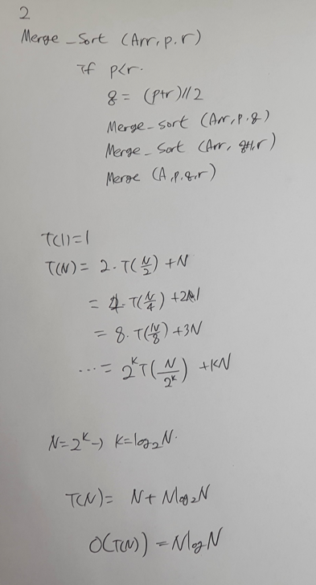

# 재귀

## 2번 (Merge Sort Time Complexity Proof)




## 6번


```python
class Node:
    def init(self, data):
        self.left = None
        self.mid = None
        self.right = None
        self.data = data

root = Node('[030]')
root.left = Node('[054]')
root.mid = Node('[002]')
root.right = Node('[045]')
root.left.left = Node('[001]')
root.right.left = Node('[123]')

def pre_order(node):
    if node:
        print(node.data, end=' ')
        if node.left:
            print('---', end=' ')
        pre_order(node.left)
        print('\n')

        if node.mid:
            print('---', end=' ')
        pre_order(node.mid)
        print('\n')

        if node.right:
            print('---', end=' ')
        pre_order(node.right)
        print('\n')

pre_order(root)
```

