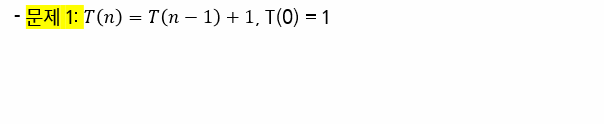
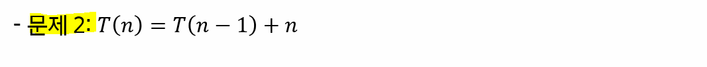
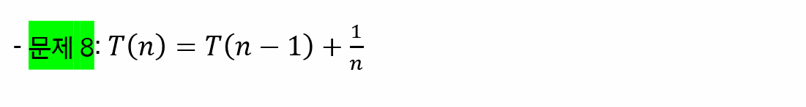

# 기초 수식

> 조원과 함께 고민하고 학습하며 설명하는 과정을 통해 작은 부분 하나라도 '내 것'으로 만들어보세요. 😁


## 1번



- `T(0) = 1`로 설정하고 진행
  - `T(n) = T(n-1) + 1`에서 1은 c로 쓰기도 한다.
- 상수항은 무시

```
T(n) = T(n-1)+1은 점화식이 아님에 유의,
f(n)에 의한 연산횟수를 의미한다. (연산량을 식으로 표기)
 
𝑇(𝑛) = 𝑇(𝑛−1) + 1
= 𝑇(𝑛−2) + 1 + 1
= 𝑇(𝑛−3) + 1 + 1 + 1
= 𝑇(𝑛−𝑘) + 𝑘

n이 k인 경우
=𝑇(0) + 𝑘

T(0)은 1로 두자고 했으니
= 1 + k

k = n이니 
= 1 + n

상수항 날리고 최고차항만 두는 형태로 보면
𝑇(𝑛) => 𝑶(𝒏)
```


## 2 번



- `T(0) = 1`로 설정하고 진행
- 상수항은 무시

$$
T(n) = T(n-1) + n \\
= T(n-2) + (n-1) + n \\
= 1 + ... + (n-1) + n \\
= \frac {n(n-1)} {2} \\
= T(n) = O(n^2)
$$


## 4번


- `T(1) = 1`로 설정하고 진행

- `2^k = n` -> `k = logn` 
  - k 자리에 logn 대입
- 상수항은 무시


$$
T(n) = 1 + T(\frac{n} {2^1}) \\
= 1 + (1 + T(\frac{n} {2^2})) \\
= 1 + (1 + 1+ T(\frac{n} {2^3})) \\
= k +  T(\frac{n} {2^k})) \\
= T(1) +  logn \\
T(n) = 1 + logn 상수항은 무시\\
T(n) = O(logn)
$$


## 6번


$$
T(n) = n + 2T(\frac{n} {2}) \\
= n + 2(\frac{n} {2} + 2 \times T(\frac{n} {4})) \\
= n + 2 \times\frac{n} {2} + 2^2 \times \frac{n} {2^2} + ... + 2^{log_{2}n} \times\frac{n} {2^{log_{2}n}} \\
= n \times log_{2} \\

T(n) = O(nlogn)
$$

- 상수항은 무시


## 8번



$$
T(n) = T(n-1) + \frac{1}{n} \\
= T(n-2) + \frac{1} {n-1} + \frac{1} {n} \\
... \\

= T(1) + \frac{1} {2} + \frac {1} {3} + \frac {1} {4} + \frac {1} {5} + \frac {1} {6} + \frac {1} {7} + ... + \frac {1} {n-2} + \frac {1} {n-1} + \frac {1} {n} \\
< T(1) + (\frac{1} {2} + \frac {1} {2}) + (\frac{1} {4} + \frac {1} {4} + \frac{1} {4} + \frac {1} {4}) + ... + (\frac{1} {n} + \frac {1} {n} + \frac{1} {n} + ... + \frac {1} {n}) \\
= T(1) + 1 + 1+ 1+ 1 = T(1) + O(log) \\
T(n) = O(logn)
$$


## 참고 자료

https://www.radford.edu/~nokie/classes/360/recurrence.eqns.revised.html
