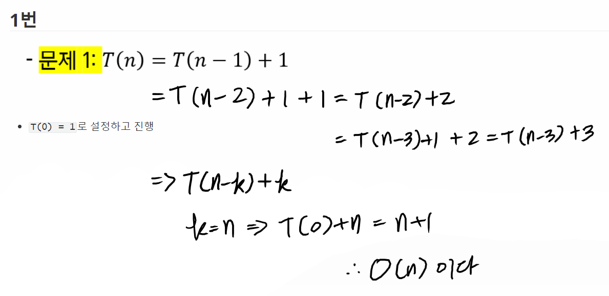
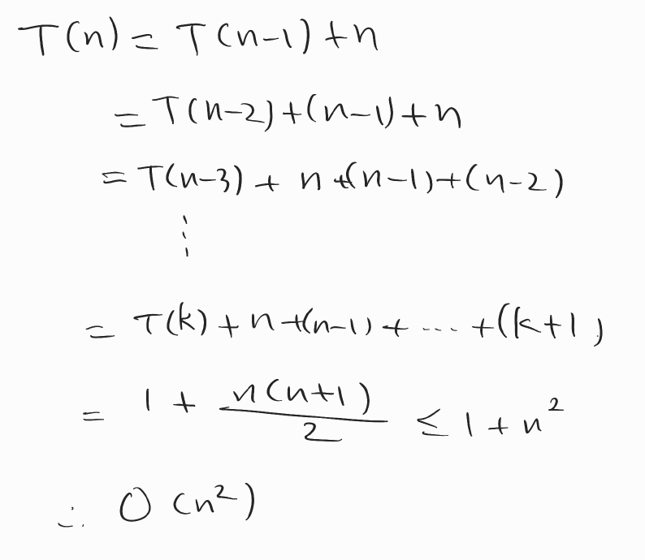
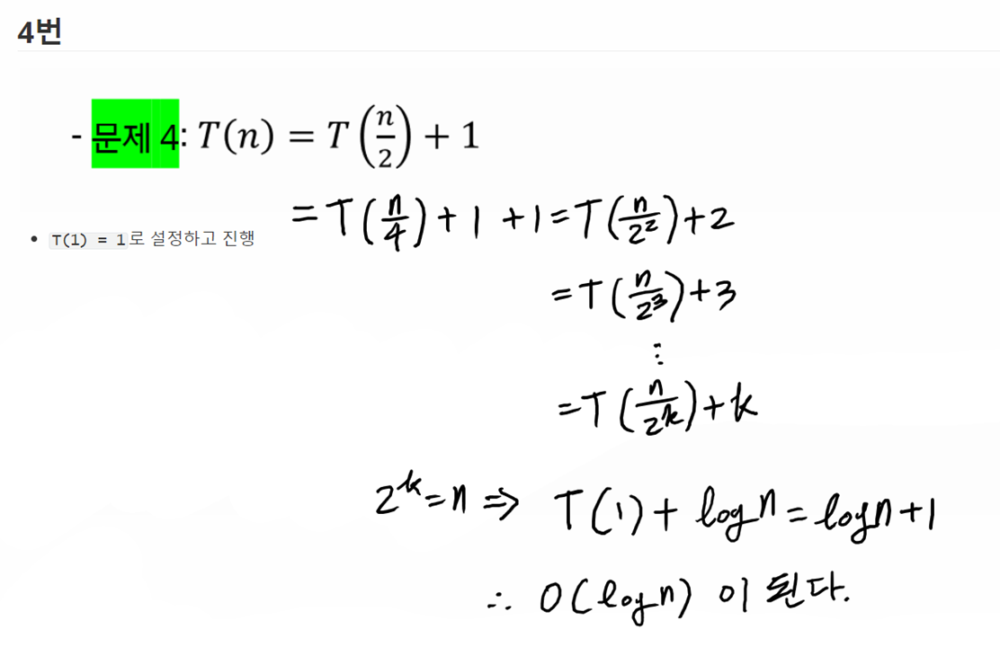
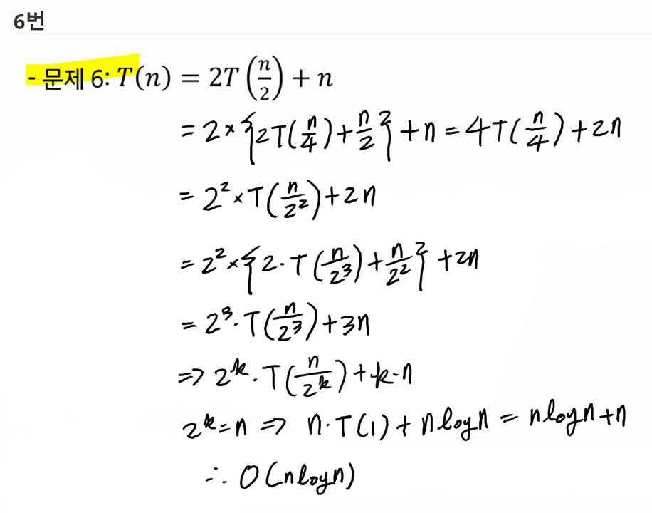
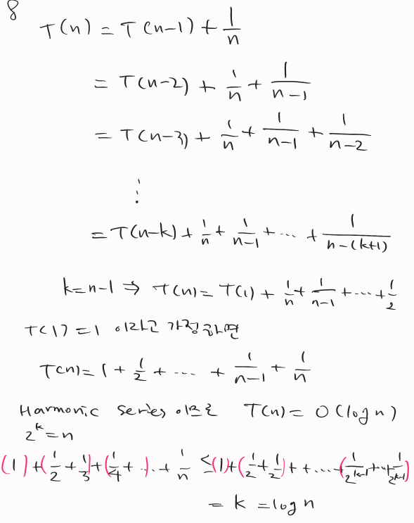
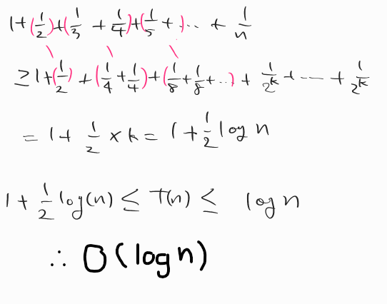

# 기초 수식

> 조원과 함께 고민하고 학습하며 설명하는 과정을 통해 작은 부분 하나라도 '내 것'으로 만들어보세요. 😁

**아래의 재귀식의 복잡도를 빅오 표기 수준으로 풀어주세요.**

## 1번

## 2 번

- `T(0) = 1`로 설정하고 진행

## 4번

## 6번

## 8번

- 참고

  https://gateoverflow.in/41209/Find-oder-of-this-algorithm-t-n-t-n-1-1-n-if-n-1

## Big-O 표기법에 대한 이해

1. **빅오 표기법의 정의**
2. **빅오 표기법의 특징**
   - ex) 상수항은 무시한다.
3. **`f(n) = 3n^2 + 2n + 5`를 빅오 표기법으로 표시하기**

## 참고 자료

https://www.radford.edu/~nokie/classes/360/recurrence.eqns.revised.html
