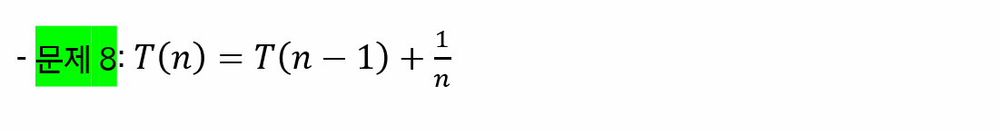

# 기초 수식

> 조원과 함께 고민하고 학습하며 설명하는 과정을 통해 작은 부분 하나라도 '내 것'으로 만들어보세요. 😁

**아래의 재귀식의 복잡도를 빅오 표기 수준으로 풀어주세요.**

## 1번

- `T(0) = 1`로 설정하고 진행

= T(n-2) + 1 + 1

= T(n-3) + 1 + 1 + 1

= T(n-k) + k

= T(0) + n       			,k = n 인 경우

= 1 + n

따라서 O(n)

## 2 번

- `T(0) = 1`로 설정하고 진행

= T(n-2) + n + (n-1)

= T(n-3) + n + (n-1) + (n-2)

= T(n-k) + kn - (k-1)(1+(k-1))/2 

= T(n-k) + kn - k(k-1)/2

= T(0) + n^2 - (n^2 - n)/2					,k = n 인 경우

= T(0) + (n^2)/2 - n/2

= 1 + (n^2)/2 - n/2

따라서 O(n^2)

## 4번

- `T(1) = 1`로 설정하고 진행

= T(n/(2^2)) + 1 + 1

= T(n/(2^3)) + 1 + 1 + 1

= T(n/(2^k)) + k

= T(1) + logn			,2^k = n, k = logn

= 1 + logn

따라서 O(logn)

## 6번

= 2(2T(n/2^2) + n/2) + n

= 2(2(2T(n/2^3) + n/2^2) + n/2) + n

= 2^kT(n/2^k) + 2^(k-1)n/2^(k-1) + ... + 2n/2 + n

= 2^kT(n/2^k) + kn

= nT(1) + nlogn							,2^k = n, k = logn

따라서 O(nlogn)

## 8번

- 참고

  https://gateoverflow.in/41209/Find-oder-of-this-algorithm-t-n-t-n-1-1-n-if-n-1

`T(1) = 1` 로 설정

= T(n−2) + 1/(n−1) + 1/n

= T(n−3) + 1/(n−2) + 1/(n−1) + 1/n

= T(n−k) + 1/(n−(k−1)) + 1/(n−(k−2)) + ... + 1/n

= T(1) + 1/(n−(n−2)) + 1/(n−(n−3)) + ... + 1/n			,k = n-1

= 1 + 1/2 + 1/3 + ... + 1/n

따라서 O(logn)

## Big-O 표기법에 대한 이해

1. **빅오 표기법의 정의**
2. **빅오 표기법의 특징**
   - ex) 상수항은 무시한다.
3. **`f(n) = 3n^2 + 2n + 5`를 빅오 표기법으로 표시하기**

## 참고 자료

https://www.radford.edu/~nokie/classes/360/recurrence.eqns.revised.html
